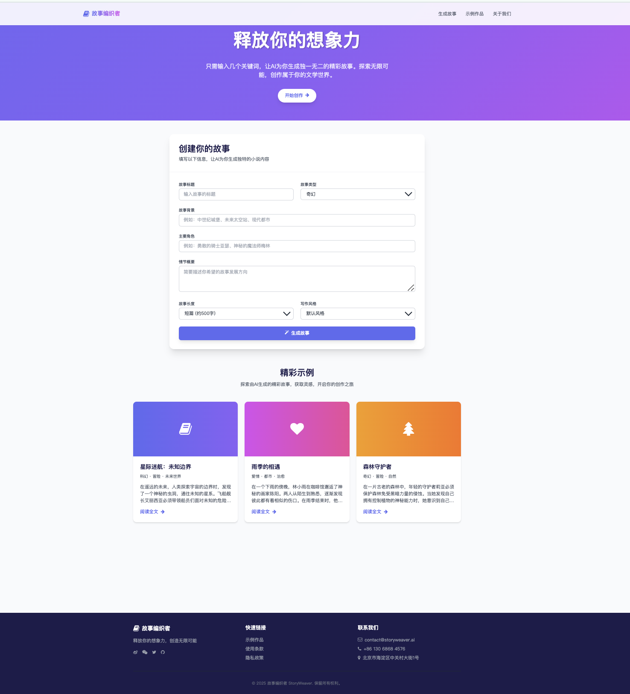

# 故事编织者 - AI小说生成网站

这是一个基于AI的小说生成网站，用户可以通过网页界面输入故事参数，系统会自动生成完整的小说内容。

## 项目结构

```
StoryWeaver/
├── examples/            # 示例小说
├── generate_chapters.py # 生成章节内容
├── generate_outline.py  # 生成小说大纲
├── merge_chapters.py    # 合并章节成完整小说
├── output/              # 输出目录
├── utils/               # 工具函数
├── web/                 # 网页前端
│   ├── index.html       # 主页面
│   ├── script.js        # 前端逻辑
│   ├── style.css        # 样式文件
│   └── us.html          # 关于我们页面
├── app.py               # Flask应用，连接前端和后端
└── README.md            # 项目说明
```

## 环境准备

1. 安装Python 3.8+和pip
2. 安装项目依赖：
   ```bash
   pip install flask
   # 安装其他可能需要的依赖（根据实际情况）
   ```

## 运行方法

1. 启动Flask后端服务：
   ```bash
   cd ./
   python app.py
   ```
   服务将运行在 http://localhost:5000

2. 打开网页前端：
   - 直接在浏览器中打开 `./web/index.html`
   - 或使用VS Code Live Server等工具提供网页服务

3. 使用平台：
   - 在网页表单中填写故事标题、类型、背景等信息
   - 点击"生成故事"按钮
   - 等待故事生成完成（可能需要一些时间）
   - 查看、复制或下载生成的故事

## 功能说明

1. **前端功能**：
   - 用户友好的表单界面
   - 实时生成状态显示
   - 故事结果展示、复制、下载

2. **后端功能**：
   - 接收前端参数
   - 生成小说大纲
   - 生成章节内容
   - 合并章节成完整小说
   - 返回结果给前端

## 注意事项

1. 确保在运行前已安装所有必要的依赖
2. 生成小说可能需要一定时间，请耐心等待
3. 本项目需要网络连接以调用AI模型
4. 如需修改端口号，可在app.py文件中修改`app.run()`的port参数

希望你喜欢使用故事编织者平台！
